# Web Service

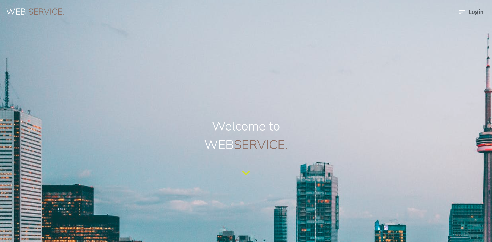

## Descripción

Este es el proyecto final realizado durante la etapa de Labs de <strong>Henry</strong>. El mismo consiste en un E-Commerce, donde se pueden ofrecer o adquirir servicios. El proyecto se llevo a cabo junto a un equipo de a 8 integrantes. Algunas de las caracteristicas principales del proyecto: Metodos de pago, Chat Online/Offline, Panel de Usuario, Filtrados, Panel de Admin.

## Integrantes

- <a href="https://github.com/claudioCMW"></a> <a href="https://www.linkedin.com/in/claudio-wusinowski-2884641a3/"></a> Claudio Miguel Wusinowski
- <a href="https://github.com/Facupelli"></a> <a href="https://www.linkedin.com/in/facundo-pellicer-full-stack-developer/"></a> Facundo Pellicer
- <a href="https://github.com/Fedex159"></a> <a href="https://www.linkedin.com/in/federico-avelin-dev/"></a> Federico Avelin
- <a href="https://github.com/Franco1312"></a> <a href="https://www.linkedin.com/in/franco-kail-219259215/"></a> Franco Kail
- <a href="https://github.com/jonatansegovia"></a> <a href="https://www.linkedin.com/in/jonatan-segovia-dev/"></a> Jonatan Segovia
- <a href="https://github.com/wikonarider"></a> <a href="https://www.linkedin.com/in/micaela-montero-295141217/"></a> Micaela Montero
- <a href="https://github.com/stobar93"></a> <a href="https://www.linkedin.com/in/sebastiantobar-fullstack-dev/"></a> Sebastian Tobar
- <a href="https://github.com/valentinjara27"></a> <a href="https://www.linkedin.com/in/valentin-jara-fullstackdeveloper/"></a> Valentin Jara

## Dependencias utilizadas

- Express 4.17.1
- Node 12.21
- NPM 7.20.3
- React 17.0.1
- Redux 4.1.1

Y muchas más dependencias, consultar los package.json de la ruta <a href="./api/package.json">/api</a> y <a href="./client/package.json">/client</a>.

## Instrucciones para utilizar el proyecto

- Clonar o forkear el repositorio

### Configurando la DB

Crear un archivo <strong>.env</strong> en la carpeta <strong>/api</strong> con los sigs parámetros:

```bash
DB_NAME = "nombre base de datos"
DB_USER = "usuario de postgres"
DB_PASSWORD = "contraseña de postgres"
DB_HOST = "localhost"
ENV_VARIABLE = "1(valor del force de sequelize, 1 === true o 0 === false)"
ORIGIN = "http://localhost:3000"
SUCCESS_MERCADOPAGO = "http://localhost:3001"
SECRET_KEY = "key para encriptar el token, puede ser cualquier string"
```

Una vez creado y configurado el <strong>.env</strong>, hacer npm install parado en el directorio <strong>/api</strong>.

Para ejecutar el servidor, utilizar <strong>npm start</strong> (solo node), o <strong>npm run start:dev</strong> (con nodemon).

### Configurando el front

Para el front no se requiere de configuraciones adicionales. Parado en la carpeta <strong>/client</strong>, realizar <strong>npm install</strong>.

Para poner en linea el servidor del front, utilizar <strong>npm start</strong> (la primera vez puede tardar un rato).

### Mockups

En la carpeta <strong><a href="./api/mock">/api/mock</a></strong> se encuentran todos los mocks para hacer las pruebas.

- Cuentas de <a href="./api/mock/usersJson.js">usuarios</a>
- Cuentas de <a href="./api/mock/testUser MercadoPago.js">mercadopago</a>
- Cuentas de <a href="./api/mock/testUsers paypal">paypal</a>

## Presentación y funcionalidades

### Landing


Landing page, se muestra el logo de la aplicacion, cuenta con animaciones, 2 cards principales, una lleva al Home de la web, el otro te lleva a un formulario de registro y acceso al Login en la parte superior derecha.

### Register


Formulario de registro. Se puede registrar de manera clasica, o utilizando los datos de google para rellenar el formulario.

### Login


Formulario de login. Se puede loguear utilizando las credenciales clasicas, o utilizando las credenciales de google, si la cuenta registrada fue creada con un mail de google valido.

### Forgot password

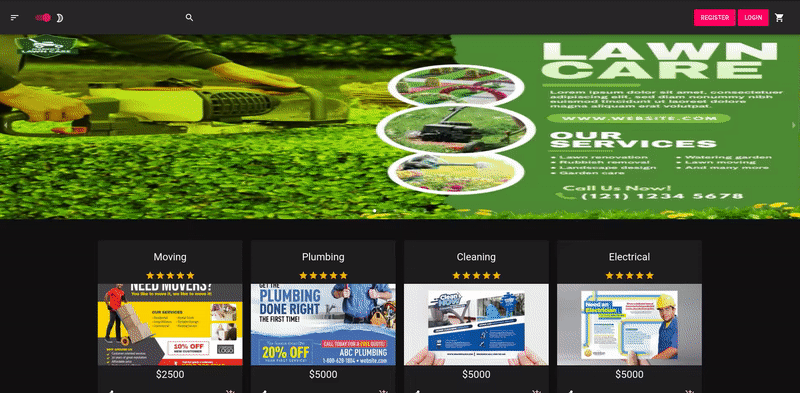

Funcionalidad de recuperar contraseña. Se envia un correo con un link para restablecer la contraseña, en caso de que se haya olvidado la misma.

### Home


Pantalla principal de la web. Se puede acceder al panel de filtros en el borde superior izquierdo, carrito en el borde superior derecho, tambien se puede registrar y loguear desde el home. Cuenta con una search bar, un carrousel con los servicios destacados y las cards con informacion principal de cada servicio ofrecido.

### Filters


Barra de filtros. Se puede hacer varios filtros combinados, ya sea elegir mas de una sub-categoria, filtrar por Provincia, Ciudad, por rango de precio u ordenar por Rating/Precio/Fecha, en forma Descendente o Ascendente.

### Darkmode

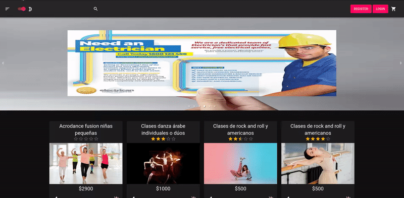

Funcionalidad de darkmode. Se puede seleccionar entre activar o desactivar el darkmode. La seleccion se aplica a toda la web y se almacena la seleccion en localStorage.

### Shopping cart

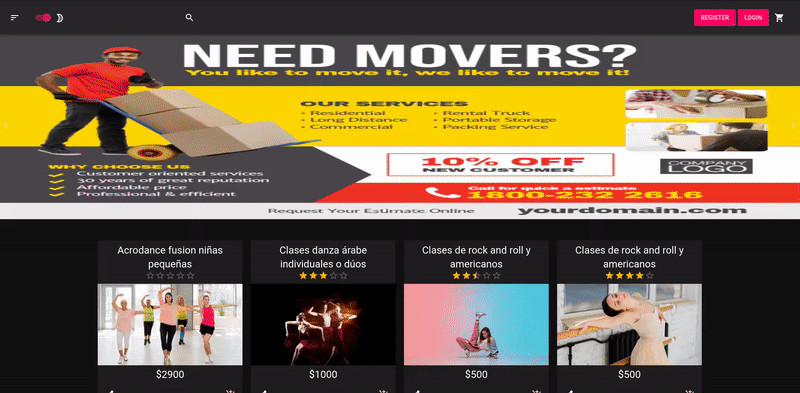

Funcionalidad de carrito. Se puede agregar y quitar servicios del carrito. Todos los servicios son de cantidad 1. El carrito se mantiene en localStorage mientras no se esta logueado, una vez logueado, se mantendra en su cuenta hasta que se eliminen los items o se finalice la compra.

### Checkout


Funcionalidad de checkout. Se pueden remover items del carrito, hacer el pago por la plataforma de Mercadopago o por la plataforma de Paypal.

### Search


Funcionalidad de busqueda. Se puede hacer busqueda por nombre, ya sea que contenga tales caracteres, o nombre exacto. A la busqueda se le pueden aplicar los filtros de la barra lateral.

### Shared

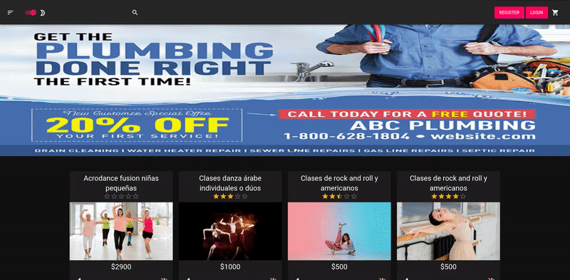

Funcionalidad de compartir. Se puede compartir por Whatsapp, Facebook o Linkedin.

### Paged


Funcionalidad de paginado. Carga 20 resultados mas, si hay resultados.

### Detail Service

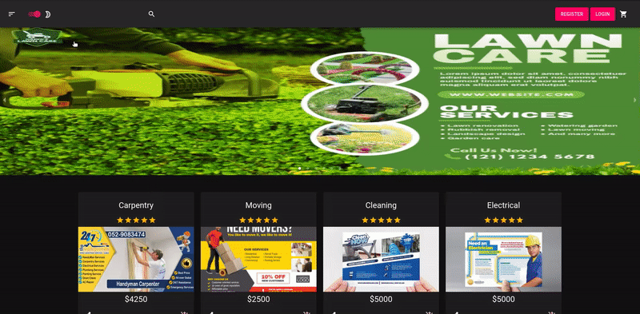

Detalle del servicio. En el se puede ver el titulo completo, imagen, descripcion, precio, comentarios, servicios relacionados, vendedor, localizacion del servicio.

### Qualification


El usuario que adquirio el servicio puede dejar una calificacion y un comentario. La calificacion puede ser de 1 a 5 estrellas.

### Profile User

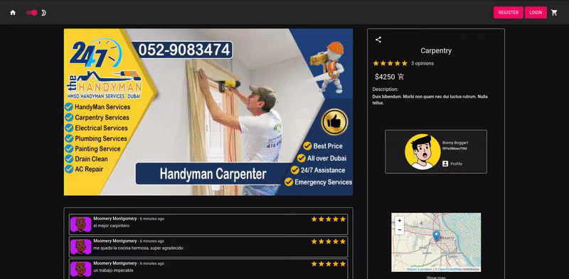

Perfil del vendedor. Se pueden ver los servicios que ofrece el vendedor, y compartir su perfil.

### User panel


Panel de usuario. En el se pueden cambiar los datos del usuario, como la foto de perfil, nombre, apellido y contraseña. Tambien se pueden ver las ordenes que haya comprado, como el detalle de la misma, los servicios que tiene en favoritos, los servicios que tiene publicados, la opcion de crear nuevos servicios y la seccion para ir al chat.

### Chat

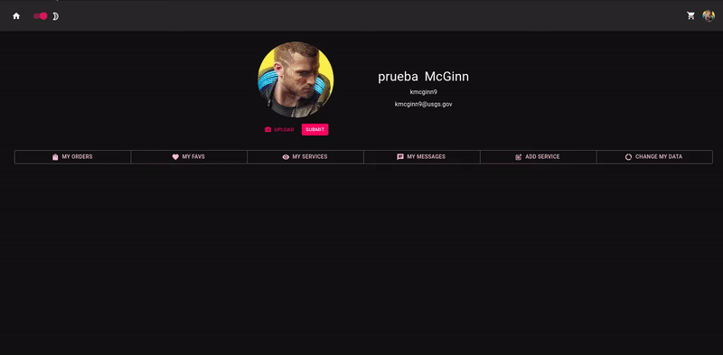

Funcionalidad de chat. En el se encuentran los contactos a los que se les realizo alguna compra. El chat muestra el estado de un usuario, si se encuentra en linea o no. Se puede hacer tanto como un live chat, como un chat de mensajes, donde el vendedor/comprador podra ver sus mensajes luego.

### Admin

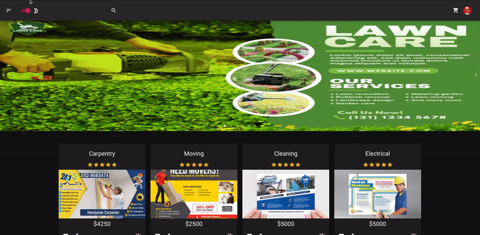

Panel de admin. El administrador cuenta con privilegios mayores a los de un usuario comun. En el dashboard inicial, puede observar las estadisticas generales de la web, puede aplicar un filtrado tambien para ver en mas detalles las estadisticas.

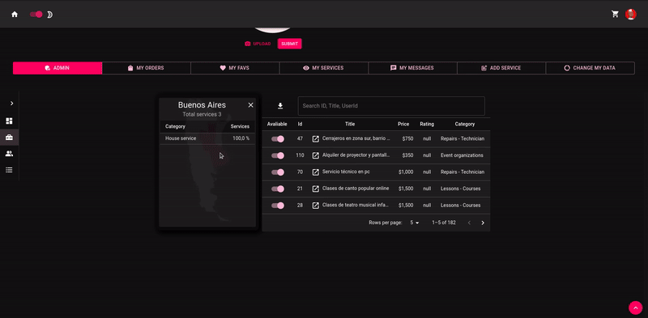

En la seccion de servicios, puede ver un mapa interactivo, con la informacion de servicios por cada ubicacion, tambien cuenta con el poder de deshabilitar un servicio, descargar el listado de servicios en formato .CSV.

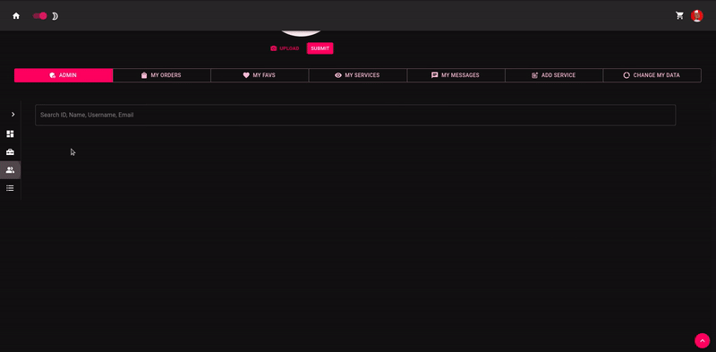

En la seccion de usuarios, puede buscar un usuario o varios usuarios, cambiarle los datos personales, o aplicarle un veto de la web.

### Responsive

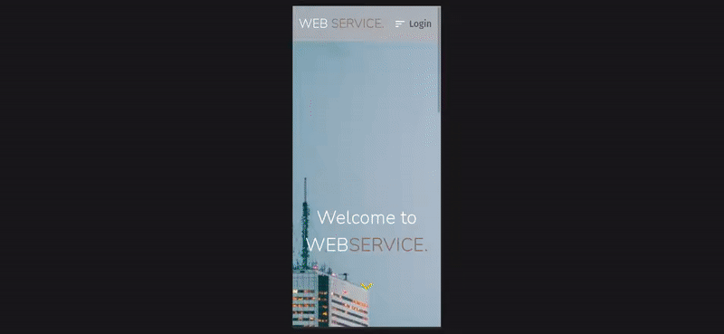

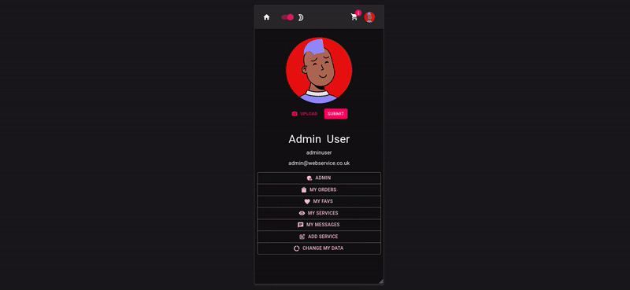

Toda la app se encuentra configurada para funcionar de manera responsive.
